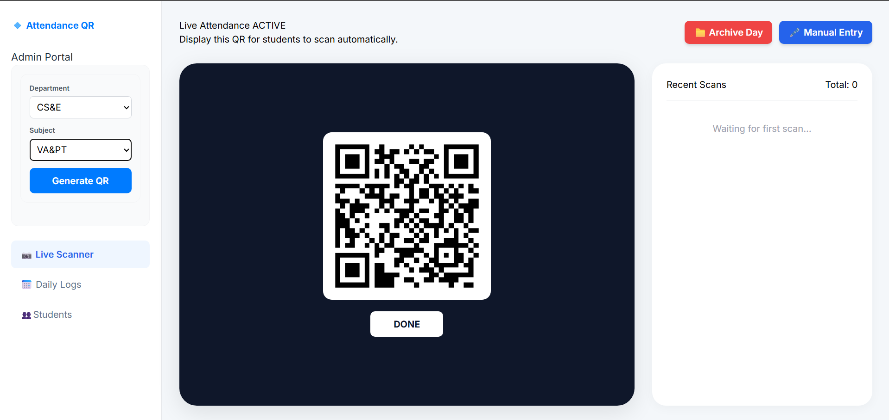

# QRAttend - QR-Based Attendance System

A modern, real-time attendance tracking system built with Django. This project uses dynamic QR codes and location-based verification to ensure students are physically present during attendance marking.

## 🚀 Key Features
* **Live Scanner**: Admin dashboard with real-time dynamic QR generation.
* **Daily Logs**: Detailed historical attendance records with expandable lecture information.
* **User Database**: A professional, styled directory of all registered students with profile cards.
* **Location Security**: Verifies GPS coordinates to prevent students from scanning QR codes remotely.

## 🛠️ Tech Stack
* **Backend**: Django (Python 3.14+)
* **Frontend**: HTML5, CSS3 (Modern Flexbox/Grid)
* **Database**: SQLite (Default)

---

## 📦 Installation & Setup

Follow these 5 steps to get the project running on your local machine:

### 1. Clone the repository
Open your terminal and run:
```bash
git clone [https://github.com/singhnilesh9986/qr_attendance_system.git](https://github.com/singhnilesh9986/qr_attendance_system.git)
cd qr_attendance_system

### 2. Create a virtual environment
python -m venv venv
# On Windows:
venv\Scripts\activate
# On macOS/Linux:
source venv/bin/activate

### 3. Install dependencies
pip install django

### 4. Run Migrations
python manage.py makemigrations
python manage.py migrate

### 5. Start the server
python manage.py runserver
# Visit http://127.0.0.1:8000/ in your browser to see the app.

### 6. Admin Credentials
# To access the Admin Portal and the Student Database, create a superuser:
python manage.py createsuperuser

[alt text](image-1.png)


